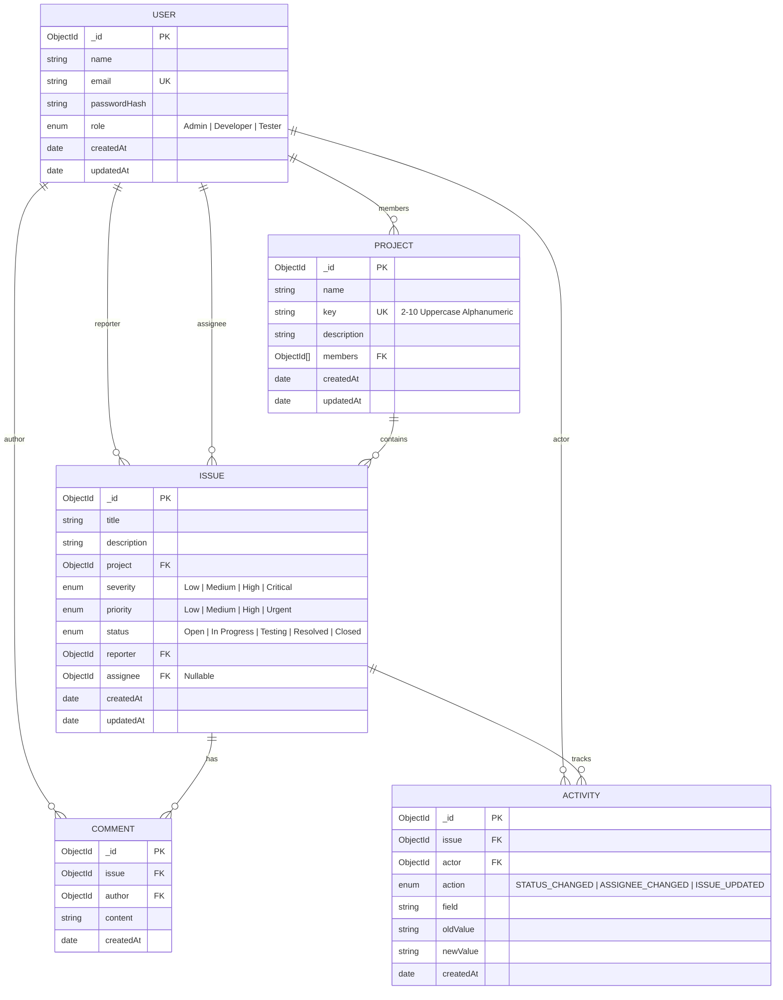
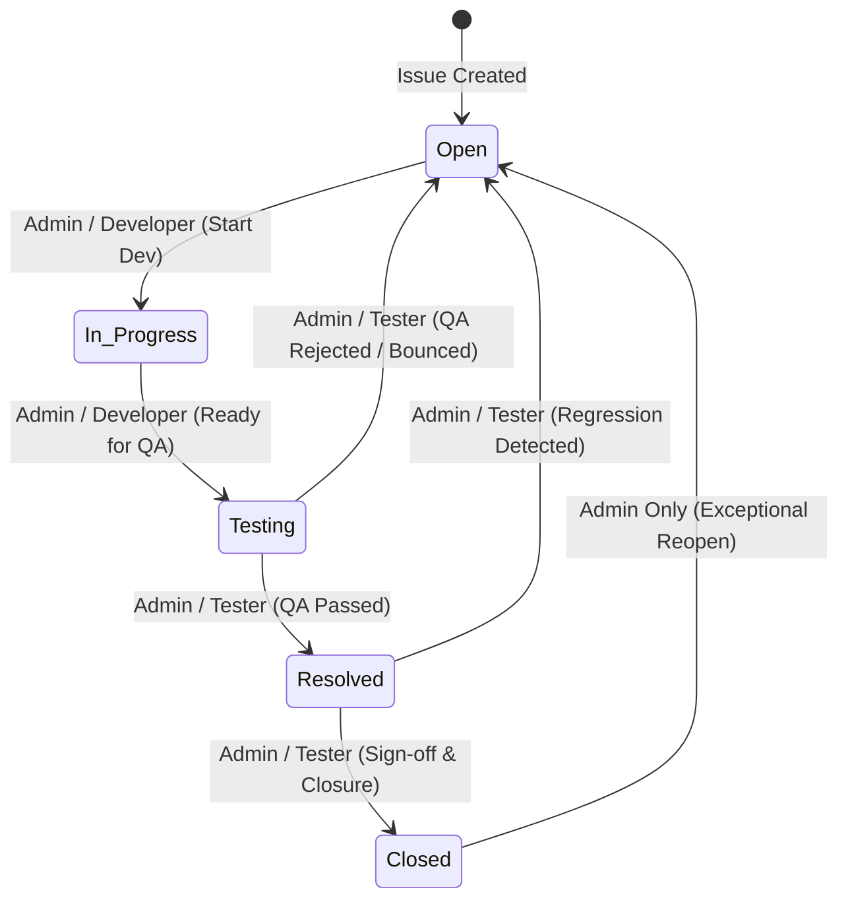

# BugBoard — Comprehensive System Context & Architecture Guide

> **Repository:** `Bug_Board_assignment`  
> **Project Name:** BugBoard (High-Performance Engineering Console & Bug Tracker)  
> **Architecture Pattern:** Clean-Architecture MERN (MongoDB, Express, React, Node.js) with ES Modules  
> **Current Version:** 1.0.0 (Hardened Production-Grade)  

---

## Table of Contents
1. [Executive Summary & Problem Statement](#1-executive-summary--problem-statement)
2. [Technology Stack & Architectural Decisions](#2-technology-stack--architectural-decisions)
3. [Domain Models & Database Architecture](#3-domain-models--database-architecture)
4. [Role-Based Access Control (RBAC) & Security Boundaries](#4-role-based-access-control-rbac--security-boundaries)
5. [Status Transition Workflow Engine](#5-status-transition-workflow-engine)
6. [Audit Logging & Activity Tracking Subsystem](#6-audit-logging--activity-tracking-subsystem)
7. [API Endpoints Specification](#7-api-endpoints-specification)
8. [Frontend "Engineering Console" UI & Design System](#8-frontend-engineering-console-ui--design-system)
9. [Adversarial Security Hardening (B1–B39 & Exploit Chains)](#9-adversarial-security-hardening-b1b39--exploit-chains)
10. [Test Suites & Automated Verification Gates](#10-test-suites--automated-verification-gates)
11. [Project Directory Layout](#11-project-directory-layout)
12. [Environment Configuration & Deployment Guide](#12-environment-configuration--deployment-guide)

---

## 1. Executive Summary & Problem Statement

**BugBoard** is an enterprise-grade issue tracking and defect lifecycle management platform tailored for engineering teams. It enforces rigid role-based access control, strict server-side state machines, tamper-proof audit trails, and multi-tenant project isolation.

### Core Objectives
1. **Zero-Trust Multi-Tenancy**: Users only see projects and issues to which they are explicitly granted access.
2. **Server-Enforced State Transitions**: Status progression (e.g. `Open` → `In Progress` → `Testing` → `Resolved` → `Closed`) is strictly validated on the backend. Frontend UI buttons never substitute for authorization checks.
3. **Comprehensive Audit Activity Log**: Every state transition, reassignment, and mutation generates an immutable activity record with before/after state diffs.
4. **"Engineering Console" UI**: A dark/light modern UI with responsive grids, monospace identifiers, interactive member rosters, and accessible controls.
5. **Penetration-Tested Reliability**: Fortified against timing attacks, IDOR, NoSQL injection, privilege escalation, and type confusion vulnerabilities.

---

## 2. Technology Stack & Architectural Decisions

### 2.1 Backend Core
* **Runtime**: Node.js (v20+ LTS) using native **ES Modules (`import`/`export`)**.
* **Framework**: Express.js (v4.x) with centralized error envelopes and asynchronous route wrapping.
* **Database**: MongoDB (v6.0+) managed via **Mongoose ODM (v8.x)** with strict schema validation.
* **Validation Engine**: `express-validator` (v7.x) executing type-guards, regex constraints, and custom sanitizers before hitting controllers.
* **Authentication**: Stateless JSON Web Tokens (`jsonwebtoken`) signed with HMAC-SHA256, paired with `bcryptjs` (cost factor 12) for salted password hashing.
* **Logging**: Structured JSON logging via `pino` and `pino-http` for sub-millisecond request profiling.
* **Security Middleware**: `helmet` (CSP, HSTS, frameguard), `cors` (credentialed whitelist), and `express-rate-limit` (DDoS/brute-force defense).

### 2.2 Frontend Core
* **Framework**: React.js (v18.x) powered by **Vite** for sub-second HMR and optimized production bundles.
* **Routing**: `react-router-dom` (v6.x) with declarative `ProtectedRoute` guards and URL query synchronizers.
* **HTTP Client**: Axios with automatic JWT Bearer token interceptors, unified error handling, and 401 redirect dispatchers.
* **Styling**: Vanilla CSS Design Tokens (zero Tailwind dependency) structured around CSS variables for instant theme switching (light/dark mode) and minimal runtime footprint.

---

## 3. Domain Models & Database Architecture



### 3.1 Database Indexes & Query Optimizations
* **Projects**: `{ key: 1 }` (Unique), `{ members: 1 }` (Multi-key index for fast access filtering).
* **Issues**:
  * `{ project: 1, status: 1 }`: Compound index optimizing project-scoped status boards.
  * `{ assignee: 1 }`: Single field index powering "Assigned to me" dashboard widgets.
  * `{ title: "text", description: "text" }`: Full-text search index for keyword queries.
  * `{ createdAt: -1 }`: Sort index for chronological issue pagination.
* **Activity**: `{ issue: 1, createdAt: -1 }`: Fast timeline lookups for issue audit trails.

---

## 4. Role-Based Access Control (RBAC) & Security Boundaries

BugBoard enforces three distinct system roles with strictly partitioned operational capabilities:

| Functional Capability | `Admin` | `Developer` | `Tester` | Enforcement Layer |
|---|:---:|:---:|:---:|---|
| **Create New Project** | ✅ Yes | ❌ No | ❌ No | `authorizeRole(['Admin'])` |
| **Update Project Details / Members** | ✅ Yes | ❌ No | ❌ No | `authorizeRole(['Admin'])` |
| **View Project & Members Roster** | ✅ All Projects | 🔒 Member Only | 🔒 Member Only | `ProjectService.listProjects` query gating |
| **Create Issue** | ✅ Yes | 🔒 Member Only | 🔒 Member Only | `IssueService.createIssue` member check |
| **Transition: Open → In Progress** | ✅ Yes | ✅ Yes | ❌ No | Workflow Engine State Machine |
| **Transition: In Progress → Testing** | ✅ Yes | ✅ Yes | ❌ No | Workflow Engine State Machine |
| **Transition: Testing → Resolved** | ✅ Yes | ❌ No | ✅ Yes | Workflow Engine State Machine |
| **Transition: Testing → Open (Reject)**| ✅ Yes | ❌ No | ✅ Yes | Workflow Engine State Machine |
| **Transition: Resolved → Closed** | ✅ Yes | ❌ No | ✅ Yes | Workflow Engine State Machine |
| **Transition: Resolved → Open (Reopen)**| ✅ Yes | ❌ No | ✅ Yes | Workflow Engine State Machine |
| **Transition: Closed → Open (Admin Reopen)**| ✅ Yes | ❌ No | ❌ No | Workflow Engine State Machine |
| **Reassign Issue** | ✅ Yes | 🔒 Member Only | 🔒 Member Only | Project co-membership check |
| **Directory Lookup (`GET /users`)** | ✅ All Users | 🔒 Co-members (Admins hidden) | 🔒 Co-members (Admins hidden) | `UserService.listUsers` RBAC scope |

---

## 5. Status Transition Workflow Engine

BugBoard's issue lifecycle is governed by a deterministic, server-enforced state machine:



### Transition Validation Rules:
1. **Invalid Transition Paths**: Attempting any status jump not defined in the transition table (e.g. `Open` → `Resolved` or `Open` → `Closed`) returns `HTTP 400 Bad Request` with an explicit message indicating legal next states.
2. **Unauthorized Roles**: Attempting a valid transition path with an unpermitted role (e.g. Developer trying `Resolved` → `Closed`) returns `HTTP 400 Bad Request` with role-specific diagnostics.
3. **Automatic Audit Recording**: Every valid status change automatically records an `ACTIVITY` entry with previous and new status strings.

---

## 6. Audit Logging & Activity Tracking Subsystem

The `Activity` subsystem logs every mutation to issues to guarantee audit compliance and non-repudiation:

* **Status Changes**: Captured as `STATUS_CHANGED`, tracking `oldValue` (e.g. "Open") and `newValue` (e.g. "In Progress").
* **Assignee Changes**: Captured as `ASSIGNEE_CHANGED`, tracking previous assignee name/id and new assignee name/id (or "Unassigned").
* **Issue Updates**: Captured as `ISSUE_UPDATED` whenever `title`, `description`, `priority`, or `severity` fields are modified.
* **Cascade Cleans**: When an admin removes a member from a project, all open issues assigned to that user are automatically unassigned and recorded in the audit log.

---

## 7. API Endpoints Specification

All routes are prefixed under `/api/v1` and return a uniform response envelope:
```json
{
  "success": true,
  "message": "Operation completed successfully",
  "data": { ... }
}
```

### 7.1 Authentication & User Endpoints
* `POST /api/v1/auth/register` — Create account with initial role.
* `POST /api/v1/auth/login` — Authenticate credentials; returns JWT token + user profile. Constant-time dummy hash on missing user.
* `GET /api/v1/auth/me` — Retrieve currently authenticated user context.
* `GET /api/v1/users` — User directory. Scoped to co-members and non-admin users for Developer/Tester callers.

### 7.2 Projects Endpoints
* `POST /api/v1/projects` — (Admin only) Create project with key validation (`/^[A-Z0-9]{2,10}$/`). Auto-adds creator.
* `GET /api/v1/projects` — List accessible projects with aggregated `issueCount` and `memberCount`.
* `GET /api/v1/projects/:projectId` — Get project details with populated member roster.
* `PATCH /api/v1/projects/:projectId` — (Admin only) Update name, description, and members array. Retains Admin and cascades dangling assignees.

### 7.3 Issues Endpoints
* `POST /api/v1/issues` — Create issue in project. Enforces reporter = `req.user.id` and validates assignee membership.
* `GET /api/v1/issues` — Server-side filtered query engine (`project`, `status`, `priority`, `severity`, `assignee`, `reporter`, `search`, `sort`, `page`, `limit`).
* `GET /api/v1/issues/:issueId` — Get single issue details.
* `PATCH /api/v1/issues/:issueId` — Update issue content (`title`, `description`, `priority`, `severity`). Emits audit log.
* `PATCH /api/v1/issues/:issueId/status` — State-machine status transition.
* `PATCH /api/v1/issues/:issueId/assignee` — Reassign issue to a valid project member or `null`.
* `GET /api/v1/issues/:issueId/activities` — Retrieve timeline audit records.

### 7.4 Comments & Dashboard
* `POST /api/v1/issues/:issueId/comments` — Add comment to an issue.
* `GET /api/v1/issues/:issueId/comments` — Retrieve all comments for an issue.
* `GET /api/v1/dashboard` — Aggregated real-time metrics (`totalIssues`, `byStatus`, `bySeverity`, `assignedToMe`, `recentActivities`).
* `GET /api/v1/health` — System health check + MongoDB connection status.

---

## 8. Frontend "Engineering Console" UI & Design System

BugBoard utilizes a custom CSS design system inspired by high-performance engineering tools (Linear, Datadog, GitHub):

```
client/src/
├── api/
│   └── client.js            # Axios instance with auth interceptor
├── context/
│   ├── AuthContext.jsx       # Auth state, login, logout, token persistence
│   └── ToastContext.jsx      # Global toast notification queue
├── layouts/
│   ├── MainLayout.jsx        # Sidebar navigation + header + user profile
│   └── PublicLayout.jsx      # Clean minimal container for login/register
├── pages/
│   ├── DashboardPage.jsx     # Live console, stat cards, assigned work queue, activity feed
│   ├── ProjectsPage.jsx      # Project cards, interactive avatar stacks, team roster modal
│   ├── IssuesPage.jsx        # Table/grid views, server-side filter sheet, search, sort
│   ├── IssueDetailPage.jsx   # Status transitions, assignee switcher, audit log, comments
│   ├── LoginPage.jsx         # Credentials login with live validation
│   └── RegisterPage.jsx      # Account creation with role selection
└── components/
    ├── ui/                   # Modular UI tokens (Badge, Button, Drawer, Modal, Skeleton)
    ├── IssueForm.jsx         # Issue creation modal
    ├── ProjectForm.jsx       # Project creation & edit modal (Admin)
    └── ProjectMembersModal.jsx # Team roster breakdown (Admins, Devs, Testers)
```

### Design System Tokens (Defined in `index.css`):
* **Colors**: Deep slate canvas (`#0F1117` dark / `#F7F8FA` light), teal accent (`#0E7C7B` / `#17A398`), warm priority ramp (Urgent `#D64545`), cool severity ramp (Critical `#B0234B`).
* **Typography**: `Inter` for clean readability; `JetBrains Mono` for issue keys, IDs, and timestamps.
* **Accessibility**: Dual visual cues (icon + label) on every status badge to ensure WCAG 2.1 AA compliance.

---

## 9. Adversarial Security Hardening (B1–B39 & Exploit Chains)

BugBoard has been subjected to deep penetration testing and hardened against 39 distinct attack vectors:

| Bug ID | Vulnerability Classification | Mitigation Implemented | File Reference |
|---|---|---|---|
| **B13 / Bug #1** | User Directory & Role Leak | Scoped `GET /api/v1/users` to project co-members and non-admin users for non-admins | `user.service.js` |
| **B15 / Bug #5** | Admin Lockout via Project Update | `updateProject` automatically preserves the requesting Admin in `members` | `project.service.js` |
| **B16 / Bug #3** | Silent Unassignment via Empty Payload | `updateAssigneeValidator` requires explicit presence of `assignee` key | `issue.validators.js` |
| **B17** | Empty Project Members Array | Enforced `members.length >= 1` in `updateProject` | `project.service.js` |
| **B21** | Dangling Assignees on Member Removal | Removing a user from a project auto-unassigns their issues and logs activity | `project.service.js` |
| **B36 / Bug #8** | Missing General Update Audit Trail | General `PATCH /issues/:id` now logs `ISSUE_UPDATED` in `Activity` | `issue.service.js` |
| **B37** | Object Injection / Type Confusion | Added `.isString()` validators on `title` and `description` | `issue.validators.js` |
| **B38** | 0-Project User Query Anomaly | Reordered project authorization check to return consistent `403 Forbidden` | `issue.service.js` |
| **B39** | Login Account Enumeration Timing Attack | Constant-time dummy bcrypt verification on nonexistent accounts (~250ms) | `auth.service.js` |
| **EC-1** | Reconnaissance → Ghost Unassignment Chain | **Neutralized**: B13 scoped user list; B16 blocked undefined unassigns | Server-wide |
| **EC-2** | Admin Lockout & Lateral Escalation Chain | **Neutralized**: B15 retains Admin; B38 enforces 403 on foreign projects | Server-wide |

---

## 10. Test Suites & Automated Verification Gates

BugBoard includes comprehensive test suites covering unit, integration, and adversarial penetration tests:

1. **Foundation & API Suite** (`tests/foundation.test.js`, `tests/api.test.js`):
   - Health check endpoints, MongoDB connection status, uniform 404/500 error envelopes, security headers.
2. **Authentication & RBAC Suite** (`tests/auth.test.js`):
   - Password hashing, JWT signing/verification, role enforcement on protected endpoints, rate-limiting.
3. **Projects & Issues Suite** (`tests/project.test.js`, `tests/issue.test.js`):
   - Project key formatting, multi-tenant isolation, workflow transition state machine, audit activity logging.
4. **Deep Bug Hunter Adversarial Suite** (`tests/deep-hunt.test.js`):
   - 100+ automated test cases asserting security defenses across all B1–B39 vulnerabilities and exploit chains.

```bash
# Run the complete test battery
npm run test:all
```

---

## 11. Project Directory Layout

```
Bug_Board_assignment/
├── client/                     # Vite React Single Page Application
│   ├── src/
│   │   ├── api/                # Axios client
│   │   ├── components/         # Reusable UI & modal components
│   │   ├── context/            # Auth and Toast React context providers
│   │   ├── layouts/            # MainLayout and PublicLayout
│   │   ├── pages/              # Dashboard, Projects, Issues, Detail, Auth
│   │   └── index.css           # Design tokens and global CSS
│   ├── package.json
│   └── vite.config.js
├── server/                     # Express.js REST API
│   ├── src/
│   │   ├── config/             # DB connection and environment variables
│   │   ├── constants/          # Roles, workflow transitions, severities
│   │   ├── controllers/        # Route handler functions
│   │   ├── middlewares/        # Auth, RBAC, error handling, rate limiting
│   │   ├── models/             # Mongoose schemas (User, Project, Issue, Activity, Comment)
│   │   ├── routes/             # Express routers mounted at /api/v1
│   │   ├── services/           # Core business logic & database queries
│   │   ├── utils/              # Token signer, seed data, logger
│   │   └── validators/         # express-validator schemas
│   ├── tests/                  # Node.js native test runner suites
│   ├── package.json
│   └── server.js
├── docs/                       # Architecture and requirement documentation
├── chat.md                     # Full chronological conversation history
├── context.md                  # This document
└── README.md                   # Project overview & quickstart
```

---

## 12. Environment Configuration & Deployment Guide

### 12.1 Server Environment (`server/.env`)
```env
PORT=5000
NODE_ENV=development
CLIENT_URL=http://localhost:5173
MONGODB_URI=mongodb://localhost:27017/bugboard
JWT_SECRET=super_secret_jwt_key_for_testing_purposes_only
JWT_EXPIRES_IN=7d
RATE_LIMIT_WINDOW_MS=900000
RATE_LIMIT_MAX=100
```

### 12.2 Client Environment (`client/.env`)
```env
VITE_API_BASE_URL=http://localhost:5000/api/v1
```

### 12.3 Running Locally
```bash
# 1. Install root, client, and server dependencies
npm install
cd server && npm install
cd ../client && npm install

# 2. Start Backend Development Server (using in-memory or local MongoDB)
cd server
npm run dev:mem

# 3. Start Frontend Development Server
cd client
npm run dev
```

### 12.4 Seed Accounts for Testing
* **Admin User**: `admin@bugboard.test` / `Password123!`
* **Lead Developer**: `dev@bugboard.test` / `Password123!`
* **QA Tester**: `tester@bugboard.test` / `Password123!`
