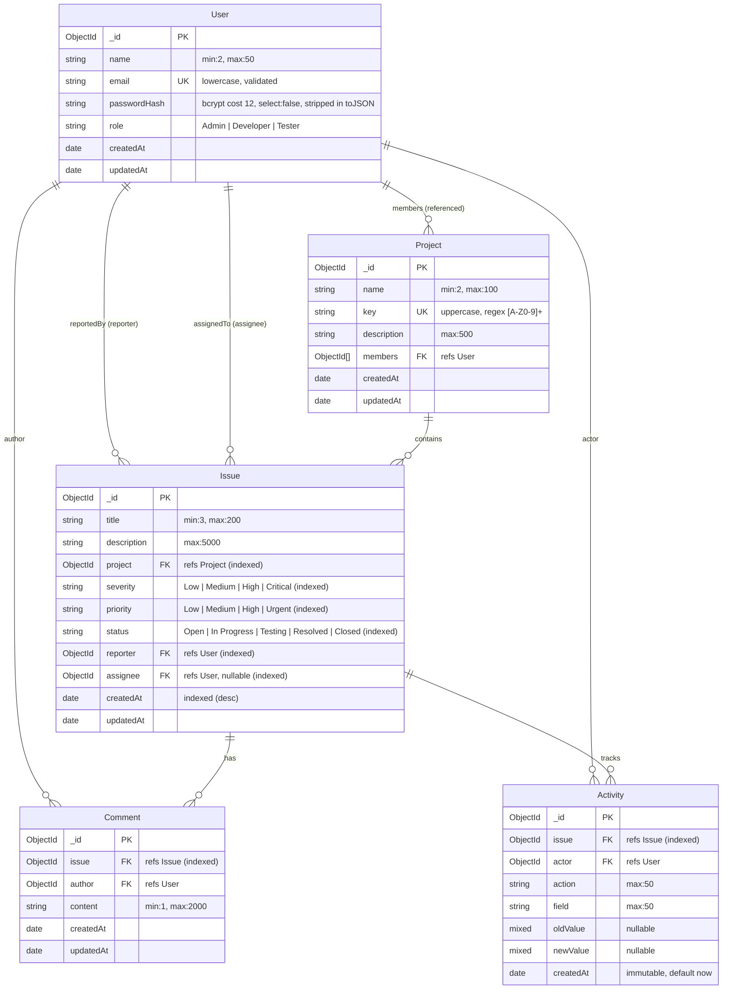

# BugBoard — Database Architecture & Schema Design

## 1. Overview
This document outlines the MongoDB schema design for **BugBoard**, modeled via Mongoose. The database architecture is designed specifically to fulfill the functional requirements of an enterprise issue tracking platform (similar to Jira), emphasizing data integrity, query performance, and explainability.

---

## 2. Mermaid Entity-Relationship (ER) Diagram



---

## 3. Embedding vs. Referencing Architectural Decisions

In MongoDB, document modeling requires deliberate evaluation of data lifecycles, cardinality, document growth patterns, and query access paths.

### 3.1 Project.members: Array of User ObjectIds (Referencing)
* **Decision**: Referenced via `[{ type: Schema.Types.ObjectId, ref: 'User' }]`.
* **Rationale**:
  1. **Independent Lifecycle & Deduplication**: Users exist as independent entities in the system with their own credentials, profile details, and roles. Embedding user subdocuments inside projects would duplicate user data across multiple projects, making user profile updates (e.g. name or email changes) multi-document write operations prone to inconsistency.
  2. **Bounded Array Cardinality**: Typical project teams have tens or hundreds of members, well below the 16MB BSON document limit. Storing an array of `ObjectId` references remains lightweight and allows performant population using Mongoose `.populate('members', 'name email role')`.
  3. **Bidirectional Querying**: Facilitates querying "which projects does user X belong to?" using `{ members: userId }`.

### 3.2 Issue in Project: Separate Collection (Referencing)
* **Decision**: Separate `issues` collection containing a `project` reference `ObjectId`.
* **Rationale**:
  1. **Unbounded Growth**: A project can easily accumulate thousands or tens of thousands of issues and bug reports over its lifetime. Embedding issues directly inside the Project document would inevitably breach MongoDB's 16MB document size limit and cause severe write amplification.
  2. **Independent Mutation & High Concurrency**: Issues are created, assigned, commented on, and updated independently by multiple team members concurrently. Storing them in a separate collection eliminates document-level write lock contention.

### 3.3 Comments: Separate Collection (Referencing)
* **Decision**: Separate `comments` collection referencing `issue` and `author`.
* **Rationale**:
  1. **Unbounded Pagination**: Active bugs frequently attract long discussions with dozens of comments. Embedding comments in the Issue document causes unbounded document growth and requires slicing arrays in memory.
  2. **Independent Operations**: Comment editing, deletion, and chronological pagination are cleaner and more performant when queries can target the `comments` collection directly (`Comment.find({ issue: issueId }).sort({ createdAt: 1 })`).

### 3.4 Activity: Separate Collection (Referencing)
* **Decision**: Separate `activities` collection referencing `issue` and `actor`.
* **Rationale**:
  1. **Append-Only Audit Log**: Every status transition and reassignment appends an audit record. Audit trails are strictly append-only and potentially voluminous.
  2. **Audit Query Optimization**: Separating the activity log enables efficient paginated audit timeline queries without bloating the hot `Issue` document payload.

---

## 4. Indexing Strategy (Strictly Justified)

Per project guidelines, speculative indexing is strictly avoided. Indexes are created **only** where justified by the assignment's explicit filter and uniqueness requirements:

| Collection | Field(s) | Type | Justification / Query Pattern |
| :--- | :--- | :--- | :--- |
| `users` | `email` | Unique Single-Field | Enforces unique email constraint for user authentication and optimizes login lookups (`findOne({ email })`). |
| `projects` | `key` | Unique Single-Field | Enforces unique project keys (e.g. `BUG`, `PROJ`) for Jira-style issue identifiers and lookup. |
| `issues` | `project` | Single-Field (`1`) | **Assignment Requirement**: Search and filter by `project`. Essential for retrieving all issues in a project. |
| `issues` | `status` | Single-Field (`1`) | **Assignment Requirement**: Search and filter by `status` (Open, In Progress, etc.) and dashboard status aggregations. |
| `issues` | `priority` | Single-Field (`1`) | **Assignment Requirement**: Search and filter by `priority` (Low, Medium, High, Urgent). |
| `issues` | `severity` | Single-Field (`1`) | **Assignment Requirement**: Search and filter by `severity` (Low, Medium, High, Critical). |
| `issues` | `reporter` | Single-Field (`1`) | **Assignment Requirement**: Search and filter by `reporter`. |
| `issues` | `assignee` | Single-Field (`1`) | **Assignment Requirement**: Search and filter by `assignee` and dashboard "Assigned to logged-in developer". |
| `issues` | `createdAt` | Single-Field (`-1`) | **Assignment Requirement**: Server-side sorting and recent issue timeline feeds. |
| `comments` | `issue` | Single-Field (`1`) | Required to retrieve comments for a specific issue (`Comment.find({ issue: issueId })`). |
| `activities` | `issue` | Single-Field (`1`) | Required to retrieve activity history for an issue (`Activity.find({ issue: issueId })`). |

> **Note on Compound Indexes**: Compound indexes (e.g., `{ project: 1, status: 1 }`) are omitted in Phase 1 to prevent speculative indexing. MongoDB's index intersection handles ad-hoc combinations of the above indexed filters, and specific compound indexes will only be introduced in Phase 3 if execution plans (`explain('executionStats')`) warrant optimization.

---

## 5. Schema Definitions & Validation Rules

### 5.1 User Collection (`users`)
```javascript
{
  name: { type: String, required: true, trim: true, minlength: 2, maxlength: 50 },
  email: { type: String, required: true, unique: true, lowercase: true, trim: true, match: /^\S+@\S+\.\S+$/ },
  passwordHash: { type: String, required: true, select: false }, // Hashed with bcrypt cost 12 on pre-save
  role: { type: String, required: true, enum: ['Admin', 'Developer', 'Tester'], default: 'Developer' },
  timestamps: true,
  // Serialization security transforms:
  toJSON: { transform: (doc, ret) => { delete ret.passwordHash; delete ret.__v; return ret; } },
  toObject: { transform: (doc, ret) => { delete ret.passwordHash; delete ret.__v; return ret; } }
}
// Methods: user.comparePassword(candidatePassword) -> Promise<boolean>
```

### 5.2 Project Collection (`projects`)
```javascript
{
  name: { type: String, required: true, trim: true, minlength: 2, maxlength: 100 },
  key: { type: String, required: true, unique: true, uppercase: true, trim: true, minlength: 2, maxlength: 10, match: /^[A-Z0-9]+$/ },
  description: { type: String, trim: true, maxlength: 500, default: '' },
  members: [{ type: Schema.Types.ObjectId, ref: 'User' }],
  timestamps: true
}
```

### 5.3 Issue Collection (`issues`)
```javascript
{
  title: { type: String, required: true, trim: true, minlength: 3, maxlength: 200 },
  description: { type: String, required: true, trim: true, maxlength: 5000 },
  project: { type: Schema.Types.ObjectId, ref: 'Project', required: true, index: true },
  severity: { type: String, required: true, enum: ['Low', 'Medium', 'High', 'Critical'], default: 'Medium', index: true },
  priority: { type: String, required: true, enum: ['Low', 'Medium', 'High', 'Urgent'], default: 'Medium', index: true },
  status: { type: String, required: true, enum: ['Open', 'In Progress', 'Testing', 'Resolved', 'Closed'], default: 'Open', index: true },
  reporter: { type: Schema.Types.ObjectId, ref: 'User', required: true, index: true },
  timestamps: true
}
```
**Phase 3 Explicit Index Strategy on Issues:**
- `{ project: 1, status: 1 }` (Compound Index): Supports fast project-scoped status filtering (e.g. board / issues list queries).
- `{ title: 'text', description: 'text' }` (Full-Text Search Index): Powers relevance-ranked `$text` keyword search across issue titles and descriptions.
- `{ assignee: 1 }`: Fast lookup for user assignment and "Assigned to me" dashboard feeds.
- `{ reporter: 1 }`: Fast lookup for user-reported issues.
- `{ createdAt: -1 }`: Sort index for default chronological issue listing.


### 5.4 Comment Collection (`comments`)
```javascript
{
  issue: { type: Schema.Types.ObjectId, ref: 'Issue', required: true, index: true },
  author: { type: Schema.Types.ObjectId, ref: 'User', required: true },
  content: { type: String, required: true, trim: true, minlength: 1, maxlength: 2000 },
  timestamps: true
}
```

### 5.5 Activity Collection (`activities`)
```javascript
{
  issue: { type: Schema.Types.ObjectId, ref: 'Issue', required: true, index: true },
  actor: { type: Schema.Types.ObjectId, ref: 'User', required: true },
  action: { type: String, required: true, trim: true, maxlength: 50 },
  field: { type: String, required: true, trim: true, maxlength: 50 },
  oldValue: { type: Schema.Types.Mixed, default: null },
  newValue: { type: Schema.Types.Mixed, default: null },
  createdAt: { type: Date, default: Date.now, immutable: true }
}
```

---

## 6. Timestamp Strategy
- Every mutable business entity (`User`, `Project`, `Issue`, `Comment`) uses `{ timestamps: true }`, providing standardized `createdAt` and `updatedAt` ISO-8601 UTC timestamps automatically managed by Mongoose.
- The `Activity` collection represents an immutable event stream; it uses `{ timestamps: false }` with an explicit, immutable `createdAt: { type: Date, default: Date.now, immutable: true }` property.
